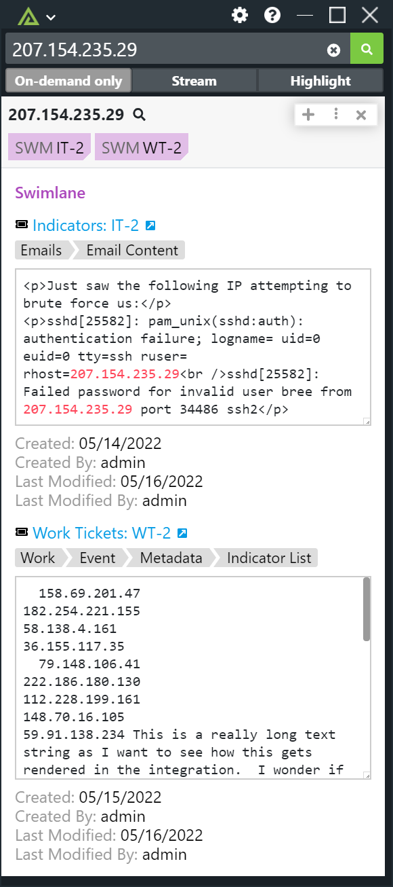

# Polarity Swimlane Integration



## Swimlane Integration Options

### URL

URL of the Swimlane instance to use including the schema (i.e., https://). This option should be set to "Only admins can view and edit".

### Username

The username for the account you wish to authenticate as.

### Password

The password for the provided user.

### Applications to Search

A comma-delimited, case-insensitive list of application names you would like to search. Provide the application name and not the application id. This option should be set to "Only admins can view and edit".

# Maximum number of results to return

The maximum number of results that will be returned to the overlay window. Defaults to 10. This option should be set to "Only admins can view and edit".

### Number of Summary Tags

The number of record IDs to show in the Polarity Overlay window summary. Defaults to 5. This option should be set to "Only admins can view and edit".

## Troubleshooting

### Error: Cannot run searches due to a failure to load the Swimlane application 

On the first search of the integration, the integration will attempt to cache Swimlane application data.  You will see the following error if the integration was unable to cache the Swimlane applications:

```
Cannot run searches due to a failure to load the Swimlane application
```

This error can occur if an invalid username/password was used on the first search.  You can force the integration to attempt to re-cache the Swimlane applications by restarting the integration.

### Making changes to applications in Swimlane

If an application is changed or added within Swimlane, the integration will need to be restarted to load these changes.


## Installation Instructions

Installation instructions for integrations are provided on the [PolarityIO GitHub Page](https://polarityio.github.io/).

## Polarity

Polarity fuses disparate data sources into a single unified view. For more information about the Polarity platform please see:

https://polarity.io/
